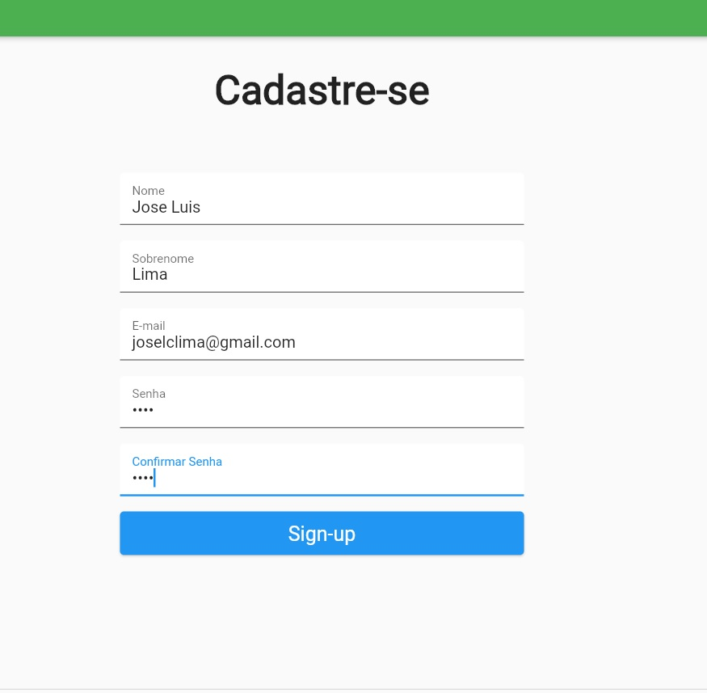
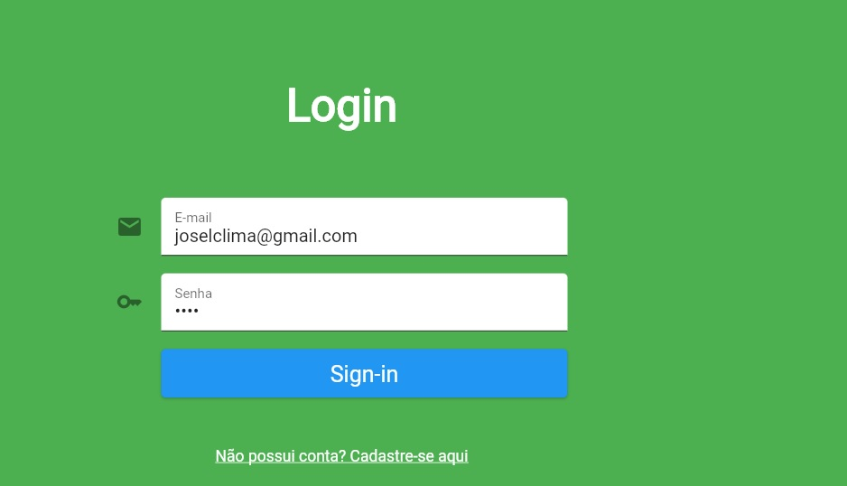
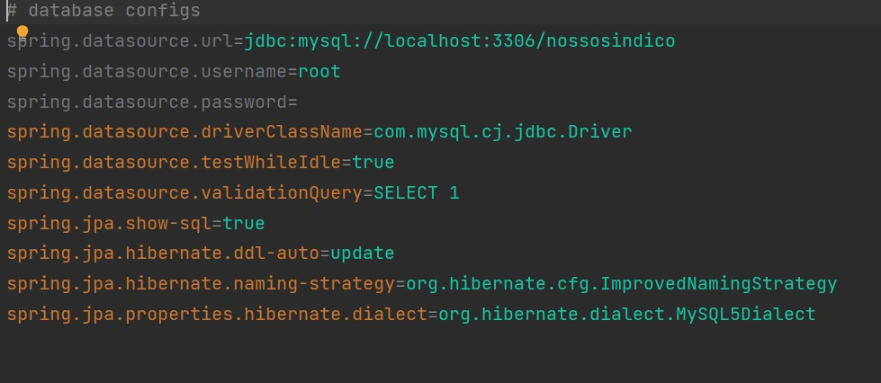
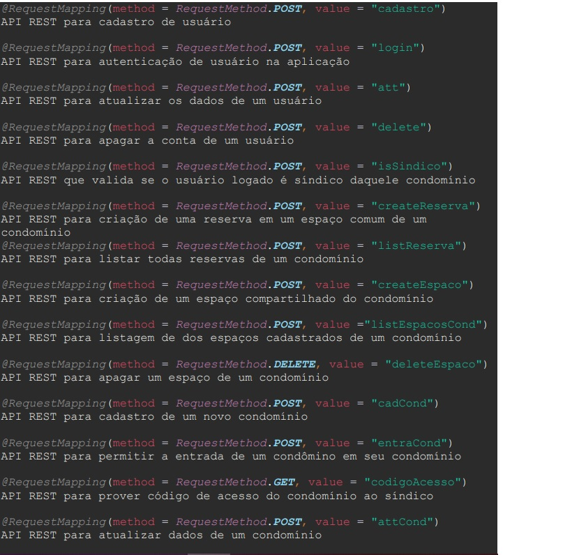
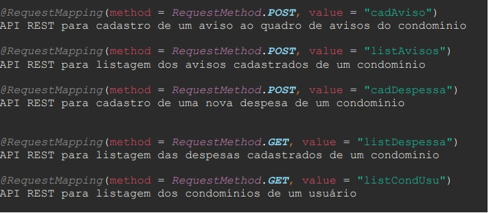
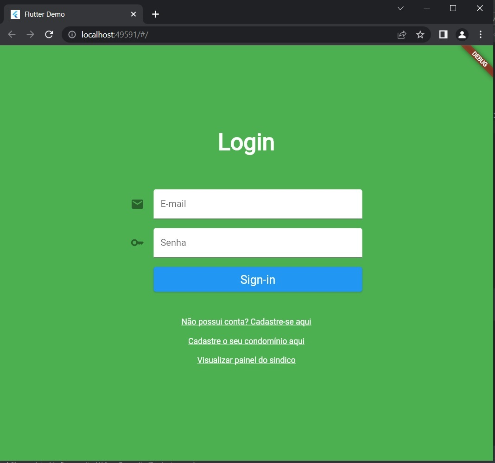

# **ATAM**

## Cenários

**Cenário 1 - Acessibilidade:** Testar a acessibilidade do sistema que deve ser acessível para diversos públicos de usuários, sobretudo para suas funcionalidades mais básicas.

**Cenário 2 - Interoperabilidade:** Verificar a capacidade e comportamento do sistema de se comunicar com seus diversos componentes

**Cenário 3 - Portabilidade:** Testar a disponibilidade e as funcionalidades do sistema,que deve ter o mesmo padrão de comportamento, em plataformas distintas, seja web, seja mobile.

**Cenário 4 - Segurança:** Testar se o sistema está protegendo os dados dos usuários e condomínios, com as restrições e permissões de acesso a esses dados de forma correta, de modo que só o usuário possa ver e editar seus próprios dados e só um usuário com permissão de síndico.

**Cenário 5 - Desempenho:** Testar o desempenho do sistema a partir do tempo de resposta que esse oferece às requisições feitas pelo usuário.

| **Atributo de Qualidade:** | Segurança |
| --- | --- |
| **Requisito de Qualidade** | Ações restritas a usuários síndicos |
| **Preocupação:** | Somente o usuário que for identificado como síndico de um condomínio que pode realizar algumas ações sobre esse |
| **Cenários(s):** | Cenário 4 |
| **Ambiente:** | Sistema em operação normal |
| **Estímulo:** | Acesso do síndico do condomínio as funcionalidades de cadastro de avisos, despesas mensais, espaços, eventos e editar dados do condomínio |
| **Mecanismo:** | O sistema valida se o usuário logado no momento está credenciado como síndico do espaço condominial que ele se encontra no momento, em que somente se a validação ser verdadeira este poderá ter acessos à página do painel do síndico, onde ele pode realizar o cadastro e a edição de eventos, despesas, dados do condomínio e espços compartilhados |
| **Medida de Resposta:** | A área restritas de um condomínio deve ser disponibilizada apenas quando há o acesso do usuário síndico desse espaço. |

| **Atributo de qualidade** | Usabilidade |
| --- | --- |
| **Requisito de qualidade** | Ter boa usabilidade |
| Preocupação | O sistema deve ser fácil de se utilizar para diversos tipos e perfis de usuários, fazendo que o usuário consiga se cadastrar e entrar em um condomínio em menos de 10 clicks |
| **Cenários** | Cenário 1 |
| **Ambiente** | Sistema em operação normal |
| **Estímulo** | Preencher campos de login e cadastro de usuário |
| **Mecanismo** | O front-end foi projetado com dois formulários distintos para cadastro e login, em que o usuário deve preencher todos os campos de cada e clicar no botão para submeter os dados para completar o fluxo. |
| **Medida de Resposta** | O usuário deve conseguir completar o processo de cadastro e login em menos de 10 clicks |

| **Atributo de qualidade** | Portabilidade |
| --- | --- |
| **Requisito de qualidade** | Ser multiplataforma |
| **Preocupação** | O sistema deve estar disponível para web e Android |
| **Cenários** |  Cenário 3 |
| **Ambiente** | Sistema em operação normal |
| **Estímulo** | Aplicação ativa e funcional nas duas versões |
| **Mecanismo** | A aplicação foi desenvolvida em Flutter, que é um framework multiplataforma que provê suporte tanto para web, quanto para android, além disso, as telas foram projetadas de forma responsiva para que o conteúdo se adapte ao tipo de tela |
| **Medida de Resposta** | Deve ser possível acessar e usar as funcionalidades do sistema tanto em um ambiente web quanto mobile android |

| **Atributo de qualidade** | Desempenho |
| --- | --- |
| **Requisito de qualidade** | Bom desempenho  |
| **Preocupação** | O sistema deve responder as requisições em  até 10 segundos |
| **Cenários** | Cenário 5 |
|  **Ambiente** | Sistema em operação normal |
|  **Estímulo** | Chamada de APIS |
|  **Mecanismo** | A aplicação usa APIS REST para a comunicação de dados em que os endpoints são chamados apenas quando necessários |
|  **Medida de Resposta** | As respostas das chamadas estarem dentro do prazo de 10 segundos |

| **Atributo de qualidade** | Desempenho |
| --- | --- |
| **Requisito de qualidade** | Bom desempenho  |
| **Preocupação** | O sistema deverá salvar em cache  as informações do usuário logado |
| **Cenários** | Cenário 5 |
| **Ambiente** | Sistema em operação normal |
| **Estímulo** | Login |
| **Mecanismo** |O sistema implementará o shared preferences do Flutter para salvar em cache os dados do usuário logado, como forma de aumentar o desempenho da aplicação, poupando que sejam feitas requisições para o backend para um usuário logar novamente ou ver os dados de seu perfil |
| **Medida de Resposta** | Uma vez logado, os dados do usuário ficam salvos em cache, a não ser me caso de alterações desses dados|

| **Atributo de qualidade** | Interoperabilidade |
| --- | --- |
| **Requisito de qualidade** | Manter pesistência de dados com banco de dados externo  |
| **Preocupação** | O sistema deve se comunicar com um banco de dados relacional para a perssistência dos dados |
| **Cenários** | Cenário 2 |
| **Ambiente** | Sistema em operação normal |
| **Estímulo** | Qualquer operação de CRUD de algum dado ou entidade |
| **Mecanismo** | A aplicação utilizará do padrão repository de acesso aos dados no backend para provêr acesso a um banco de dados MySQL |
| **Medida de Resposta** | Os dados enviados pela aplicação serem persistidos no banco, e os reuisitados serem retornados do banco para a aplicação |

| **Atributo de qualidade** | Confiabilidade |
| --- | --- |
| **Requisito de qualidade** |Seguir a normas legais do uso de dados |
| **Preocupação** |O sistema deve apagar todos os dados relacionados a um usuário quando este apaga sua conta na aplicação |
| **Cenários** | Cenário 4 |
| **Ambiente** | Sistema em operação normal |
| **Estímulo** | Ação do usuário de deletar sua conta |
| **Mecanismo** | Quando um usuário clicar em apagar sua conta ná página de perfil do usuário, todos os dados relacionados a sua conta devem ser apagados de forma definitva das persistências de dados, isso é o banco MySQL e a shared preferences |
| **Medida de Resposta** | Os dados serão apagados das persistências |

## Evidências de teste

1) Evidência de teste de usabilidade referente ao cenário 1, em que visava-se testar se um usuário externo ao grupo conseguiria fazer o processo de cadastro e login em até 10 clicks, como pode-se ver pela sequência de imagens o usuário conseguiu preencher todos os campos nencessários e submetê-los em 9 clicks.

2) Evidência do teste de interoperabilidade referente ao cenário 2, indicando que a aplicação está se comunicando com um banco de dados relacional MySQL

3) Evidência do teste de desempenho referente ao cenário 5, em que a baixo estão listadas todas as apis rest desenvolvidas para a comunicação de dados do sistemas, em que se conta o método http de cada uma, sua rota e uma breve descrição de sua função

5) Evidência do teste de portabilidade, referente ao cenário 3, em que nesse teste visava-se comprovar o caráter multiplataforma do sistema, em que logo a baixo se encontram as imagens dele rodando via web e via mobile

