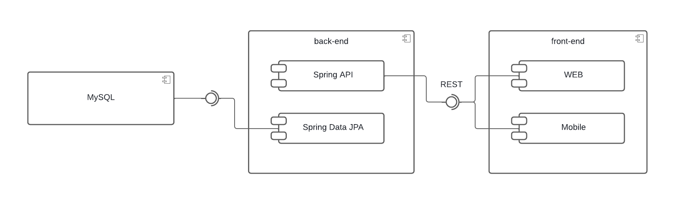

# TITULO DO PROJETO

**Integrantes:**

Bruno Silveira Cerqueira Lima, brunobhsclima@gmail.com

Gabriel Oliveira Gomide, gogomide.go@gmail.com

Geovane de Freitas Queiroz Morcatti, geovanemorcatti@gmail.com

Marcos Henrique Dias Barbosa, marcos.henrique@sga.pucminas.br

Mateus Samartini de Toledo, mateusamartini@gmail.com

---

**Professores:**

Cleiton Silva Tavares

Pedro Alves de Oliveira

---

_Curso de Engenharia de Software, Unidade Praça da Liberdade_

_Instituto de Informática e Ciências Exatas – Pontifícia Universidade de Minas Gerais (PUC MINAS), Belo Horizonte – MG – Brasil_

---

_**Resumo**. Diante das dificuldades vivenciadas na gestão condominial no cotidiano, sobretudo na manutenção de uma comunicação clara e harmônica com os condomnios e a necessidade de transparência na prestação de contas das despessas condominiais, além dos possíveis empecilhos na gestão da marcação de eventos nos espaços compartilhados, surge a necessidade de um sistema que possa auxiliar o síndico na gestão de seu condomínio. Assim, esse trabalho tem por obejtivo o desenvolvimento de uma aplicação web e mobile que ajude o síndico a superar os desafios da gestão condominial, de modo que sua gestão seja mais transparente e organizada com uma comunicação mais direta e clara com os demais moradores. Para isso, o sistmea será desenvolvido em Flutter para o Frontend e Java Spring para o Backend, junto ao uso do banco de dados relacional MySQL e o Firebase para mensageria junto ao middleware RabbitMQ. Ao longo do semestre foram implementados os principais requisitos do sistema, em que se destacam a planilha de gestão de gastos e o quadro de avisos._

---

## Histórico de Revisões

| **Data** | **Autor** | **Descrição** | **Versão** |
| --- | --- | --- | --- |
| **10/03/2022** | Bruno, Gabriel, Geovane, Marcos e Mateus | Preenchimento do documento até a sessão 3.3 | 1.0 |
|**09/06/2022** | Bruno| Revisão e preenchimento da sessão 4|2.0 |

## SUMÁRIO

1. [Apresentação](#apresentacao "Apresentação")  
	1.1. Problema:  
	1.2. Objetivos do trabalho:  
	1.3. Definições e Abreviaturas  

2. [Requisitos](#requisitos "Requisitos")  
	2.1. Requisitos Funcionais  
	2.2. Requisitos Não-Funcionais  
	2.3. Restrições Arquiteturais  
	2.4. Mecanismos Arquiteturais  

3. [Modelagem](#modelagem "Modelagem e projeto arquitetural")  
	3.1. Visão de Negócio  
	3.2. Visão Lógica  
	3.3. Modelo de dados (opcional)  

4. [Avaliação](#avaliacao "Avaliação da Arquitetura")  
	4.1. Cenários  
	4.2. Avaliação  

5. [Referências](#referencias "REFERÊNCIAS") 

6. [Apêndices](#apendices "APÊNDICES") 

# 1. Apresentação

O projeto visa ampliar e aperfeiçoar o sistema atual de gestão de condomínios, em sua maioria. Em condomínios, é muito comum ocorrerem conflitos entre condôminos e problemas estruturais que levam a necessidade de reformas, e isso, consequentemente, geram reuniões entre síndicos e condôminos para resolverem esses tipos de problemas. Em meio a isto,
são discutidos também melhorias futuras e marcação de eventos em áreas comuns dos condomínios, porém atualmente, muitas vezes, todas estas questões são discutidas informalmente ou não são levadas a sério pelos síndicos, gerando insatisfações de suas gestões, por partes dos condôminos. Portanto, o sistema a ser desenvolvido pode ser capaz de tornar mais intuitiva e transparente todas as questões relacionadas aos condomínios e de aprimorar a comunicação entre condôminos e síndicos, de forma geral.

## 1.1. Problema

Atualmente, a gestão de condomínios é, muitas vezes, limitada à grupos informais de comunicação como Whatsapp e Telegram, por exemplo. Neste contexto, embrólios relacionados
aos condomínios e até mesmo entre condôminos são conduzidos de forma mal planejada além de serem mal geridos, gerando portanto, prejuízos para os condôminos e soluções que não
são benéficas para todos.

## 1.2. Objetivos do trabalho

**Objetivo Geral**: Este trabalho tem como objetivo desenvolver um sistema que seja capaz de facilitar, e tornar mais clara e fluida a gestão de condomínios. Portanto, se espera 
um software capaz de aperfeiçoar a prestação de contas, comunicação entre moradores e agendamento de reuniões e de outros eventos, contribuindo assim, para uma gestão condominial mais organizada e transparente
 
 
**Objetivos Específicos**:
1. Disponibilizar a função de gerir o(s) condomínio(s) para o síndico.
2. Desenvolver uma aplicação de chat para conversas entre condôminos.
3. Desenvolver espaços específicos para quadro de avisos e gestão de despesas do condomínio.
4. Disponibilizar uma agenda eletrônica para os condomínios, com o intuito de gerenciar reuniões e eventos.

## 1.3. Definições e Abreviaturas

| **Abreviaturas** | **Definições** |
| --- | --- |
| RF | Requisitos funcionais |
| RNF | Requisitos não funcionais |
| UC | Casos de Uso |
| SGBD | Sistema de Gerenciamento de Banco de Dados |

# 2. Requisitos

## 2.1. Requisitos Funcionais

| **ID** | **Descrição** | **Prioridade** |
| --- | --- | --- |
| RF001 | Os usuários devem ser capazes de mantererm seus respectivos cadastros|Essencial |
| RF002 | O usuário síndico deve ser capaz de cadastrar um condomínio| Essencial|
| RF003 | O usuário síndico deve ser capaz de prover acesso aos moradores ao condomínio| Essencial |
| RF004| Todos os usuários pré-cadastrados devem conseguir fazer login em suas respectivas contas | Essencial |
| RF005| O síndico deve ser capaz de gerir o quadro de avisos do condomínio | Essencial |
| RF006| O sistema deve possuir um chat entre todos os condominos cadastrados em um condomínio | Essencial |
| RF007| O síndico deve ser capaz de manter o espaço destinado para prestação de contas e despessas mensais |desejável |
| RF008| Os moradores devem ser capazes de consultarem as páginas de quadro de avisos e prestação de contas |Essencial |
| RF009|O usuário síndico deve ser capaz de manter o registro das áreas comuns de um condomíno já cadastrado |Desejável|
| RF010| O síndico deve ser capaz de manter marcações na agenda eletrônica do condomínio | opcional |
| RF011| O síndico deve se capaz de passar o cargo de síndico para outro usuário morador | opcional |
| RF012| O sistema deve notificar para todos os condominos as postagens de novos eventos  | opcional |

## 2.2. Requisitos Não-Funcionais

| **ID** | **Descrição** |
| --- | --- |
| RNF1 |O sistema deve se comunicar com um banco de dados relacional para a perssistência dos dados |
| RNF2 |O sistema deve estar disponível para web e Android |
| RNF3 |O sistema deve possuir um middleware para a gestão das mensagens em tempo real |
| RNF4 |O sistema deve possuir um tempo de resposta satisfatório de até 10 segundos para cada requisição|
| RNF5 | O sistema deve ser fácil de se utilizar para diversos tipos e perfis de usuários, fazendo que o usuário consiga se cadastrar e entrar em um condomínio em menos de 10 clicks |
| RNF6 | O sistema deverá salvar em cache  as informações do usuário logado |
| RNF7 | O sistema deve apagar todos os dados relacionados a um usuário quando este apaga sua conta na aplicação |

## 2.3. Restrições Arquiteturais

- Precisa ter uma versão para dispositivos móveis
- O Front End será desenvolvido em Flutter
- O banco de dados deverá ser relacional MySQL
- Deve ser seguido o padrão REST para as apis 
- Deve se utilizar o RabbitMQ como middleware orientado a mensagens para gerir a troca de mensagens
- A arquitetura será baseada no padrão MVC

## 2.4. Mecanismos Arquiteturais

| **Análise** | **Design** | **Implementação** |
| --- | --- | --- |
| Persistência | ORM |SQL |
| Front end | web e moble  | Flutter |
| Back end | API REST |Java spring |
| Integração | INTEGRAÇAO CONTINUA  |github|
| Log do sistema |arquivo |Json |
| Teste de Software | Unitario |Junit |
| Deploy | | |

# 3. Modelagem e projeto arquitetural

**Figura 1 - Visão Geral da Solução (fonte: o próprio autor)**

O projeto terá como porta de acesso ao sistema, uma aplicação mobile desenvolvida na linguagem Java no ambiente de desenvolvimento integrado Android Studio, que irá disponibilizar os recursos ao consumir uma api desenvolvida no framework Spring, e finalmente o SGBD MySQL, mantendo a persistência de dados.

## 3.1. Visão de Negócio (Funcionalidades)

1. O sistema deve permitir o cadastro e o login dos usuários
2. O sistema deve permitir a manipulação do grupo de condomínio
3. O sistema deve exibir os grupos de condomínio
4. O sistema deve permitir a adesão a um grupo de condomínio
5. O sistema deve permitir a manipulação dos espaços compartilhados
6. O sistema deve exibir os espaços compartilhados
7. O sistema deve permitir a manipulação dos avisos
8. O sistema deve exibir os avisos
9. O sistema deve permitir a manipulação dos eventos
10. O sistema deve exibir os eventos
11. O sistema deve conter um ambiente de pate papo em tempo real

### Descrição resumida dos Casos de Uso

**Figura 2 - Diagrama de caso de uso (fonte: o próprio autor)**

#### UC01 – Gerir Espaço Compartilhado

| **Descrição** | O síndico poderá gerir os espaços compartilhados |
| --- | --- |
| **Atores** | Síndico |
| **Prioridade** | Baixa |
| **Requisitos associados** | RF003 |
| **Fluxo Principal** | O síndico acessa o gestor de espaço compartilhado - O sistema apresenta uma lista dos espaços compartilhados cadastrados - O síndico solicita o cadastro de um novo espaço compartilhado - O sistema apresenta um formulário de cadastro de espaço compartilhado - O síndico preenche os formulário - O sistema salva o espaço compartilhado no banco de dados e emite mensagem informando que o cadastro foi bem sucedido. |

#### UC02 – Gerir Grupo de Condomínio

| **Descrição** | O síndico poderá gerir os grupos de condomínio |
| --- | --- |
| **Atores** | Síndico |
| **Prioridade** | Alta |
| **Requisitos associados** | RF002 |
| **Fluxo Principal** | O síndico acessa o gestor de condomínios - O sistema apresenta uma lista dos grupos de condomínio cadastrados - O síndico solicita o cadastro de um novo grupo de condomínio - O sistema apresenta um formulário de cadastro de grupo de condomínio - O síndico preenche o formulário - O sistema salva os dados no banco e emite uma mensagem informando que o cadastro foi bem sucedido. |

#### UC03 – Gerir Apartamentos

| **Descrição** | O síndico poderá gerir apartamentos |
| --- | --- |
| **Atores** | Síndico |
| **Prioridade** | Alta |
| **Requisitos associados** | RF002 |
| **Fluxo Principal** | O síndico acessa o gestor de condomínios - O sistema apresenta uma lista dos grupos de condomínios cadastrados - O síndico seleciona um grupo de condomínio cadastrado - O sistema apresenta os dados do grupo de condomínio - O síndico solicita a criação de novos apartamentos - O sistema apresenta o formulário de criação de apartamento - O síndico preenche o formulário - O sistema salva os banco de dados no banco e emite um mensagem informando que o cadastro foi bem sucedido. |

#### UC04 – Gerir Condóminos

| **Descrição** | O síndico poderá gerir os Condôminos do seu grupo de condomínio |
| --- | --- |
| **Atores** | Síndico |
| **Prioridade** | Alta |
| **Requisitos associados** | RF004 |
| **Fluxo Principal** | O síndico acessa o gestor de condomínios - O sistema apresenta uma lista dos grupos de condomínios cadastrados - O síndico seleciona um grupo de condomínio cadastrado - O sistema apresenta os dados do grupo de condomínio - O síndico acessa o gestor de condôminos - O sistema apresenta uma listas dos condôminos que estão ou requisitaram acesso ao grupo de condomínio - O síndico solicita a aprovação de acesso ao grupo de um novo condômino - O sistema emite um aviso confirmando a ação - O sistema salva os banco de dados no banco e emite um mensagem informando que o cadastro foi bem sucedido. |

| **Descrição** | O síndico poderá passar o cargo de síndico a diante |
| --- | --- |
| **Atores** | Síndico |
| **Prioridade** | Alta |
| **Requisitos associados** | RF008 |
| **Fluxo Principal** | O síndico acessa o gestor de condomínios - O sistema apresenta uma lista dos grupos de condomínios cadastrados - O síndico seleciona um grupo de condomínio cadastrado - O sistema apresenta os dados do grupo de condomínio - O síndico solicita a alteração de síndico - O sistema emite um aviso confirmando a ação - O sistema salva os banco de dados no banco e emite um mensagem informando que o cadastro foi bem sucedido. |

#### UC05 – Gerir Quadro de Aviso

| **Descrição** | O síndico poderá gerir os avisos |
| --- | --- |
| **Atores** | Síndico |
| **Prioridade** | Médio |
| **Requisitos associados** | RF006 |
| **Fluxo Principal** | O síndico acessa o gestor de avisos - O sistema apresenta uma lista dos avisos cadastrados - O síndico solicita o cadastro de um novo aviso - O sistema apresenta um formulário de cadastro de aviso - O síndico preenche o formulário - O sistema salva os dados no banco e emite uma mensagem informando que o cadastro foi bem sucedido. |

#### UC06 – Gerir Agenda

| **Descrição** | O síndico poderá gerir a agenda |
| --- | --- |
| **Atores** | Síndico |
| **Prioridade** | Baixo |
| **Requisitos associados** | RF009 |
| **Fluxo Principal** | O síndico acessa o gestor de agenda - O sistema apresenta uma lista dos eventos cadastrados - O síndico solicita o cadastro de um novo evento - O sistema apresenta um formulário de cadastro de evento - O síndico preenche o formulário - O sistema salva os dados no banco e emite uma mensagem informando que o cadastro foi bem sucedido. |

#### UC07 – Gerir Conta

| **Descrição** | O usuário poderá gerenciar sua conta |
| --- | --- |
| **Atores** | Usuário |
| **Prioridade** | Alta |
| **Requisitos associados** | RF001 |
| **Fluxo Principal** | O usuário acessa o gestor de conta - O sistema apresenta os dados do usuário - O usuário solicita a atualização do seus dados - O sistema apresenta um formulário de usuário - O usuário preenche o formulário - O sistema salva os dados no banco e emite uma mensagem informando que a atualização foi bem sucedido. |

#### UC08 – Reservar Espaço Compartilhado

| **Descrição** | O usuário poderá reservar um espaço compartilhado |
| --- | --- |
| **Atores** | Usuário |
| **Prioridade** | Baixa |
| **Requisitos associados** | RF003 |
| **Pré Requisito** | Estar em um grupo de condomínio |
| **Fluxo Principal** | O usuário acessa o gestor de espaços compartilhados - O sistema apresenta dos espaços compartilhados cadastrados - O usuário solicita a reserva de um espaço - O sistema apresenta um formulário de reserva - O usuário preenche o formulário - O sistema salva os dados no banco e emite uma mensagem informando que a atualização foi bem sucedido. |

#### UC09 – Aderir a um codomínio

| **Descrição** | O usuário poderá solicitar a participação em um grupo de condomínio |
| --- | --- |
| **Atores** | Usuário |
| **Prioridade** | Alta |
| **Requisitos associados** | RF004 |
| **Fluxo Principal** | O usuário acessa o gestor de condomínios - O sistema apresenta uma lista dos grupos de condomínio cadastrados - O usuário seleciona um grupo de condomínio - O sistema apresenta os dados de exposição do grupo de condomínio - O usuário solicita a entrada ao grupo de condomínio - O sistema salva a solicitação no banco e emite uma mensagem informando que a solicitação foi bem sucedido. |

#### UC10 – Visualizar Quadro de Avisos

| **Descrição** | O usuário poderá visualizar os avisos emitidos |
| --- | --- |
| **Atores** | Usuário |
| **Prioridade** | Média |
| **Requisitos associados** | RF009 |
| **Pré Requisito** | Estar em um grupo de condomínio |
| **Fluxo Principal** | O usuário acessa o quadro de avisos - O sistema apresenta os avisos cadastrados - O usuário visualiza os avisos |

#### UC11 – Visualizar Agenda

| **Descrição** | O usuário poderá visualizar os eventos cadastrados na agenda |
| --- | --- |
| **Atores** | Usuário |
| **Prioridade** | Baixa |
| **Requisitos associados** | RF010 |
| **Pré Requisito** | Estar em um grupo de condomínio |
| **Fluxo Principal** | O usuário acessa a agenda - O sistema apresenta os eventos cadastrados - O usuário visualiza os eventos |

#### UC12 – Interagir na Sala de Bate Papo

| **Descrição** | O usuário poderá interagir na sala de bate papo |
| --- | --- |
| **Atores** | Usuário |
| **Prioridade** | Alta |
| **Requisitos associados** | RF007 |
| **Pré Requisito** | Estar em um grupo de condomínio |
| **Fluxo Principal** | O usuário acessa a sala de bate papo - O sistema apresenta as mensagens enviadas pelos usuários - O usuário solicita o envio de uma nova mensagem - O sistema apresenta a nova mensagem junto com as demais mensagens dos usuários |

## 3.2. Visão Lógica

### Diagrama de Classes

**Figura 3 – Diagrama de classes (exemplo). Fonte: o próprio autor.**

O diagrama apresenta dois principais grupos, as classes de domínio e classes de controle:
- Classes de domínio
	- Usuario 
	- Consominio
	- Bloco
	- Apartamento
	- Aviso
	- Evento
	- Espaco
- Classes de controle
	- GestorCondominio: Responsável por efetuar as operações relacionadas ao condomínio
	- GestorApartamento: Responsável por efetuar as operações relacionadas a criação do bloco e apartamento e a vinculação do condômino.
	- GestorAviso: Responsável por efetuar as operações relacionadas ao aviso
	- GestorEvento: Responsável por efetuar as operações relacionadas ao evento
	- GestorEspaco: Responsável por efetuar as operações relacionadas ao espaço compartilhado
	- GestorReserva: Responsável por efetuar as operações relacionadas a reserva do espaço compartilhado pelo condômino.
### Diagrama de componentes

**Figura 4 – Diagrama de Componentes (exemplo). Fonte: o próprio autor.**

Conforme diagrama apresentado na Figura 4, as entidades participantes da solução são:

- **MySQL** - O SGBD responsável por manter a persistência dos dados.
- **Spring API** - API que ira fornecer os serviços para a aplicação front-end.
- **Spring Data JPI** - Fornece uma abstração completa sobre a camada de acesso a dados.
- **Web** - A interface web da aplicação.
- **Mobile** - A interface mobile da aplicação.

## 3.3. Modelo de dados

 ")

**Figura 5 – Diagrama de Entidade Relacionamento (ER) - exemplo. Fonte: o próprio autor.**

A aplicação utiliza o SGBD MySQL para a persistência dos dados. Em seguida temos uma breve explicação de cada uma das entidades ilustradas na figura acima.

- Usuario: Representa os usuários da aplicação;
- Condominio: Representa os grupos de condomínio gerido pelo usuário síndico;
- Usuario_Condominio: Responsável por manter a relação dos usuários atrelados a determinado apartamento e grupo de condomínio;
- EspacoCompartilhado: Representa os espaços compartilhados cadastrados;
- Reserva: Responsável por manter a relação dos usuários e o espaço compartilhado;
- Evento: Representa os eventos cadastrado na agenda do grupo de condomínio;
- Aviso: Representa os avisos cadastrado no grupo de condomínio;
- Bloco: Representa os prédios do condomínio;
- Apartamento: Representa os apartamentos do condomínio;

# 4. Avaliação da Arquitetura

_Esta seção descreve a avaliação da arquitetura apresentada, baseada no método ATAM._

## 4.1. Cenários

_Apresente os cenários de testes utilizados na realização dos testes da sua aplicação. Escolha cenários de testes que demonstrem os requisitos não funcionais sendo satisfeitos. Os requisitos a seguir são apenas exemplos de possíveis requisitos, devendo ser revistos, adequados a cada projeto e complementados de forma a terem uma especificação completa e auto-explicativa._

**Cenário 1 - Acessibilidade:** Suspendisse consequat consectetur velit. Sed sem risus, dictum dictum facilisis vitae, commodo quis leo. Vivamus nulla sem, cursus a mollis quis, interdum at nulla. Nullam dictum congue mauris. Praesent nec nisi hendrerit, ullamcorper tortor non, rutrum sem. In non lectus tortor. Nulla vel tincidunt eros.

**Cenário 2 - Interoperabilidade:** Pellentesque habitant morbi tristique senectus et netus et malesuada fames ac turpis egestas. Fusce ut accumsan erat. Pellentesque in enim tempus, iaculis sem in, semper arcu.

**Cenário 3 - Manutenibilidade:** Phasellus magna tellus, consectetur quis scelerisque eget, ultricies eu ligula. Sed rhoncus fermentum nisi, a ullamcorper leo fringilla id. Nulla lacinia sem vel magna ornare, non tincidunt ipsum rhoncus. Nam euismod semper ante id tristique. Mauris vel elit augue.

**Cenário 4 - Segurança:** Suspendisse consectetur porta tortor non convallis. Sed lobortis erat sed dignissim dignissim. Nunc eleifend elit et aliquet imperdiet. Ut eu quam at lacus tincidunt fringilla eget maximus metus. Praesent finibus, sapien eget molestie porta, neque turpis congue risus, vel porttitor sapien tortor ac nulla. Aliquam erat volutpat.

## 4.2. Avaliação

_Apresente as medidas registradas na coleta de dados. O que não for possível quantificar apresente uma justificativa baseada em evidências qualitativas que suportam o atendimento do requisito não-funcional. Apresente uma avaliação geral da arquitetura indicando os pontos fortes e as limitações da arquitetura proposta._

| **Atributo de Qualidade:** | Segurança |
| --- | --- |
| **Requisito de Qualidade** | Ações restritas a usuários síndicos |
| **Preocupação:** | Somente o usuário que for identificado como síndico de um condomínio que pode realizar algumas ações sobre esse |
| **Cenários(s):** | Cenário 4 |
| **Ambiente:** | Sistema em operação normal |
| **Estímulo:** | Acesso do síndico do condomínio as funcionalidades de cadastro de avisos, despesas mensais, espaços, eventos e editar dados do condomínio |
| **Mecanismo:** | O sistema valida se o usuário logado no momento está credenciado como síndico do espaço condominial que ele se encontra no momento, em que somente se a validação ser verdadeira este poderá ter acessos à página do painel do síndico, onde ele pode realizar o cadastro e a edição de eventos, despesas, dados do condomínio e espços compartilhados |
| **Medida de Resposta:** | A área restritas de um condomínio deve ser disponibilizada apenas quando há o acesso do usuário síndico desse espaço. |

| **Atributo de qualidade** | Usabilidade |
| --- | --- |
| **Requisito de qualidade** | Ter boa usabilidade |
| Preocupação | O sistema deve ser fácil de se utilizar para diversos tipos e perfis de usuários, fazendo que o usuário consiga se cadastrar e entrar em um condomínio em menos de 10 clicks |
| **Cenários** |
| **Ambiente** | Sistema em operação normal |
| **Estímulo** | Preencher campos de login e cadastro de usuário |
| **Mecanismo** | O front-end foi projetado com dois formulários distintos para cadastro e login, em que o usuário deve preencher todos os campos de cada e clicar no botão para submeter os dados para completar o fluxo. |
| **Medida de Resposta** | O usuário deve conseguir completar o processo de cadastro e login em menos de 10 clicks |

| **Atributo de qualidade** | Portabilidade |
| --- | --- |
| **Requisito de qualidade** | Ser multiplataforma |
| **Preocupação** | O sistema deve estar disponível para web e Android |
| **Cenários** |
| **Ambiente** | Sistema em operação normal |
| **Estímulo** | Aplicação ativa e funcional nas duas versões |
| **Mecanismo** | A aplicação foi desenvolvida em Flutter, que é um framework multiplataforma que provê suporte tanto para web, quanto para android, além disso, as telas foram projetadas de forma responsiva para que o conteúdo se adapte ao tipo de tela |
| **Medida de Resposta** | Deve ser possível acessar e usar as funcionalidades do sistema tanto em um ambiente web quanto mobile android |

| **Atributo de qualidade** | Desempenho |
| --- | --- |
| **Requisito de qualidade** | Bom desempenho  |
| **Preocupação** | O sistema deve responder as requisições em  até 10 segundos |
| **Cenários** |
|  **Ambiente** | Sistema em operação normal |
|  **Estímulo** | Chamada de APIS |
|  **Mecanismo** | A aplicação usa APIS REST para a comunicação de dados em que os endpoints são chamados apenas quando necessários |
|  **Medida de Resposta** | As respostas das chamadas estarem dentro do prazo de 10 segundos |

| **Atributo de qualidade** | Desempenho |
| --- | --- |
| **Requisito de qualidade** | Bom desempenho  |
| **Preocupação** | O sistema deverá salvar em cache  as informações do usuário logado |
| **Cenários** |
| **Ambiente** | Sistema em operação normal |
| **Estímulo** | Login |
| **Mecanismo** |O sistema implementará o shared preferences do Flutter para salvar em cache os dados do usuário logado, como forma de aumentar o desempenho da aplicação, poupando que sejam feitas requisições para o backend para um usuário logar novamente ou ver os dados de seu perfil |
| **Medida de Resposta** | Uma vez logado, os dados do usuário ficam salvos em cache, a não ser me caso de alterações desses dados|

| **Atributo de qualidade** | Interoperabilidade |
| --- | --- |
| **Requisito de qualidade** | Manter pesistência de dados com banco de dados externo  |
| **Preocupação** | O sistema deve se comunicar com um banco de dados relacional para a perssistência dos dados |
| **Cenários** |
| **Ambiente** | Sistema em operação normal |
| **Estímulo** | Qualquer operação de CRUD de algum dado ou entidade |
| **Mecanismo** | A aplicação utilizará do padrão repository de acesso aos dados no backend para provêr acesso a um banco de dados MySQL |
| **Medida de Resposta** | Os dados enviados pela aplicação serem persistidos no banco, e os reuisitados serem retornados do banco para a aplicação |

| **Atributo de qualidade** | Confiabilidade |
| --- | --- |
| **Requisito de qualidade** |Seguir a normas legais do uso de dados |
| **Preocupação** |O sistema deve apagar todos os dados relacionados a um usuário quando este apaga sua conta na aplicação |
| **Cenários** |
| **Ambiente** | Sistema em operação normal |
| **Estímulo** | Ação do usuário de deletar sua conta |
| **Mecanismo** | Quando um usuário clicar em apagar sua conta ná página de perfil do usuário, todos os dados relacionados a sua conta devem ser apagados de forma definitva das persistências de dados, isso é o banco MySQL e a shared preferences |
| **Medida de Resposta** | Os dados serão apagados das persistências |

**Considerações sobre a arquitetura:**

| **Riscos:** | Não existe |
| --- | --- |
| **Pontos de Sensibilidade:** | Não existe |
| _ **Tradeoff** _ **:** | Não existe |

Evidências dos testes realizados

_Apresente imagens, descreva os testes de tal forma que se comprove a realização da avaliação._

# 5. REFERÊNCIAS

_Como um projeto da arquitetura de uma aplicação não requer revisão bibliográfica, a inclusão das referências não é obrigatória. No entanto, caso você deseje incluir referências relacionadas às tecnologias, padrões, ou metodologias que serão usadas no seu trabalho, relacione-as de acordo com a ABNT._

Verifique no link abaixo como devem ser as referências no padrão ABNT:

http://www.pucminas.br/imagedb/documento/DOC\_DSC\_NOME\_ARQUI20160217102425.pdf

**[1]** - _ELMASRI, Ramez; NAVATHE, Sham. **Sistemas de banco de dados**. 7. ed. São Paulo: Pearson, c2019. E-book. ISBN 9788543025001._

**[2]** - _COPPIN, Ben. **Inteligência artificial**. Rio de Janeiro, RJ: LTC, c2010. E-book. ISBN 978-85-216-2936-8._

**[3]** - _CORMEN, Thomas H. et al. **Algoritmos: teoria e prática**. Rio de Janeiro, RJ: Elsevier, Campus, c2012. xvi, 926 p. ISBN 9788535236996._

**[4]** - _SUTHERLAND, Jeffrey Victor. **Scrum: a arte de fazer o dobro do trabalho na metade do tempo**. 2. ed. rev. São Paulo, SP: Leya, 2016. 236, [4] p. ISBN 9788544104514._

**[5]** - _RUSSELL, Stuart J.; NORVIG, Peter. **Inteligência artificial**. Rio de Janeiro: Elsevier, c2013. xxi, 988 p. ISBN 9788535237016._

# 6. APÊNDICES

_Inclua o URL do repositório (Github, Bitbucket, etc) onde você armazenou o código da sua prova de conceito/protótipo arquitetural da aplicação como anexos. A inclusão da URL desse repositório de código servirá como base para garantir a autenticidade dos trabalhos._
